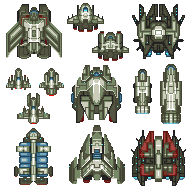
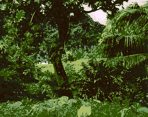
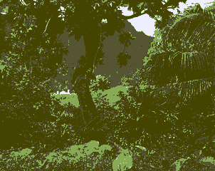

# png2svg  [](http://godoc.org/github.com/xyproto/png2svg) [](https://goreportcard.com/report/github.com/xyproto/png2svg)

Go module and command line utility for converting small PNG images to SVG Tiny 1.2.

## Features and limitations

* Draws rectangles for each region in the PNG image that can be covered by a rectangle.
* The remaining pixels are drawn with a rectangle for each pixel.
* This is not an efficient representation of PNG images!
* The conversion may be useful if you have a small PNG image or icons at sizes around 32x32, and wish to scale them up and print them out without artifacts.
* The utility is fast for small images, but larger images will take an unreasonable amount of time to convert, creating SVG files many megabytes in size. This could potentially also be used for benchmarking the single-core performance of a CPU.
* The resulting SVG images can be opened directly in a browser like Firefox or Chromium, and may look sharper and crisper than small PNG or JPEG images that are smoothed/blurred by the browser, by default (this can be configured with CSS, though).
* The default crispiness of how SVG images are displayed may be useful for displaying "pixel art" style graphics in the browser.
* Written in pure Go, with no runtime dependencies on any external library or utility.
* Handles transparent PNG images by not drawing SVG elements for the transparent regions.
* For creating SVG images that draws a rectangle for each and every pixel, instead of also using larger rectangles, use the `-p` flag.

## Image Comparison

| 192x192 PNG image (16 colors) | 192x192 SVG image (16 colors)  | 192x192 SVG image (optimized with [svgo](https://github.com/svg/svgo)) |
| ----------------------------- | ------------------------------ | ---------------------------------------------------------------------- |
| 8.2 KiB                       | 193 KiB                        | 66 KiB                                                                 |
|     |  |                                       |

The spaceships are drawn by [wuhu](https://opengameart.org/content/spaceships-1) (CC-BY 3.0).

Try zooming in on the images. Most browsers will keep the SVG image crisp when zooming in, but blur the PNG image.

For keeping PNG images crisp, this CSS can be used, but this is not normally needed for SVG images:

```css
image-rendering: -moz-crisp-edges; /* Firefox */
image-rendering: -o-crisp-edges; /* Opera */
image-rendering: -webkit-optimize-contrast; /* Webkit (non-standard naming) */
image-rendering: crisp-edges;
-ms-interpolation-mode: nearest-neighbor; /* IE (non-standard property) */
```

Right now, Chrome does not support `image-rendering: crisp-edges`, while Firefox does not support `image-rendering: pixelated`. This may change over time, check out the excellent [caniuse.com](https://caniuse.com/css-crisp-edges) page.

Using SVG to get crisp images has the advantage of not relying on CSS that may differ from browser to browser.

Other comparisons:

| 302x240 PNG image          | 302x240 SVG image (limited to 4096 colors) | 302x240 SVG (optimized with [svgo](https://github.com/svg/svgo)) |
|----------------------------|--------------------------------------------|------------------------------------------------------------------|
| 176 KiB                    | 3.1 MiB                                    | 934 KiB                                                          |
|  |              |                                 |

With palette reduction:

| `-n 96` + svgo                           | `-n 32` + svgo                           | `-n 16` + svgo                           | `-n 8` + svgo                          |
|------------------------------------------|------------------------------------------|------------------------------------------|----------------------------------------|
| 516 KiB                                  | 356 KiB                                  | 369 KiB                                  | 217 KiB                                |
|  |  |  |  |

Note that fewer colors does not always result in smaller images, because it depends on the shape of the resulting areas with the same colors and not just on having few colors.

| 64x64 PNG image        | 64x64 SVG image (one rectangle per pixel) | 64x64 SVG image (4096 colors)  | 64x64 SVG image (rectangles >1px are colored pink) | 64x64 SVG image (optimized with [svgo](https://github.com/svg/svgo)) |
|------------------------|-------------------------------------------|--------------------------------|----------------------------------------------------|----------------------------------------------------------------------|
| 4.1 KiB                | 172 KiB                                   | 74 KiB                         |                                                    | 25 KiB                                                               |
|  |    |  |                     |                                         |

The rainforest image is from [Wikipedia](https://en.wikipedia.org/wiki/Landscape).
The Glenda bunny is from [9p.io](https://9p.io/plan9/glenda.html).

## Q&A

**Q:** Why 4096 colors?<br>
**A:** Because representing colors on the short form (`#000` as opposed to `#000000`) makes it possible to express 4096 unique colors.

**Q:** Does this mean that I can make an entire web page in SVG, with photos and everything?<br>
**A:** Yes! This is not the intended use of `png2svg`, but it might work out if the images are kept small.

**Q:** Can I use this for QR codes?<br>
**A:** Yes!

**Q:** Can I use `png2svg` together with `svgo` to create assets for a game that only uses vector graphics?<br>
**A:** Yes! If the images are kept small.

**Q:** Are these questions just made up, or did someone actually ask this?<br>
**A:** Look behind you, a three headed monkey!

## Installation

For Go 1.17 or later:

    go install github.com/xyproto/png2svg/cmd/png2svg@latest

## Example usage

Generate an SVG image with as few rectangles as possible (`-o` for "output"):

    png2svg -o output.svg input.png

Generate an SVG image with one rectangle per pixel:

    png2svg -p -o output.svg input.png

Generate an SVG image where the output is limited to 4096 unique colors (`-l` for "limit"):

    png2svg -l -o output.svg input.png

Like above, but with progress information while the image is being generated:

    png2svg -v -l -o output.svg input.png

Same as above, but also reduce the number of colors to 32:

    png2svg -v -l -n 32 -o output.svg input.png

## Packaging status

[](https://repology.org/project/png2svg/versions)

## General information

* Version: 1.5.3
* Author: Alexander F. Rødseth &lt;xyproto@archlinux.org&gt;
* License: BSD-3
